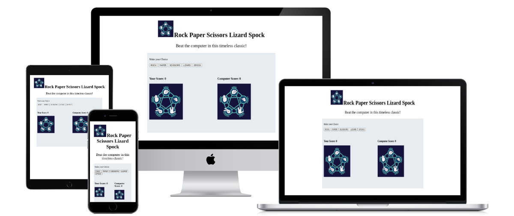
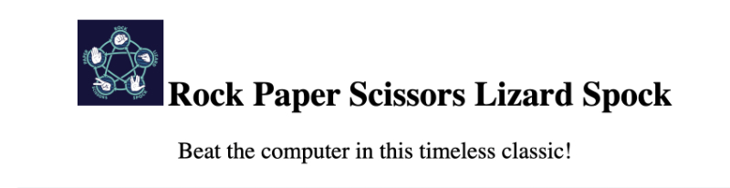
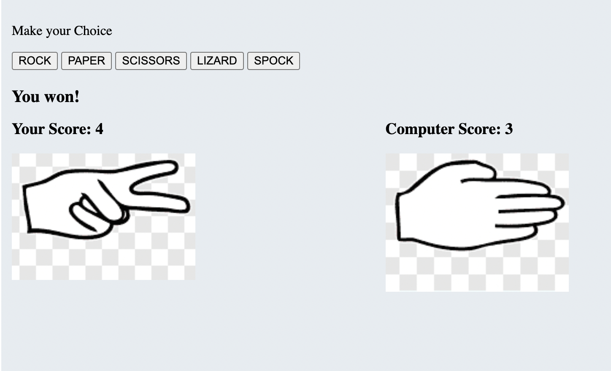
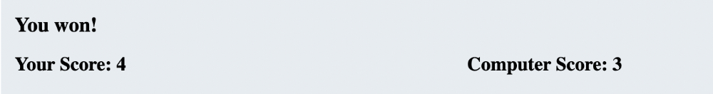
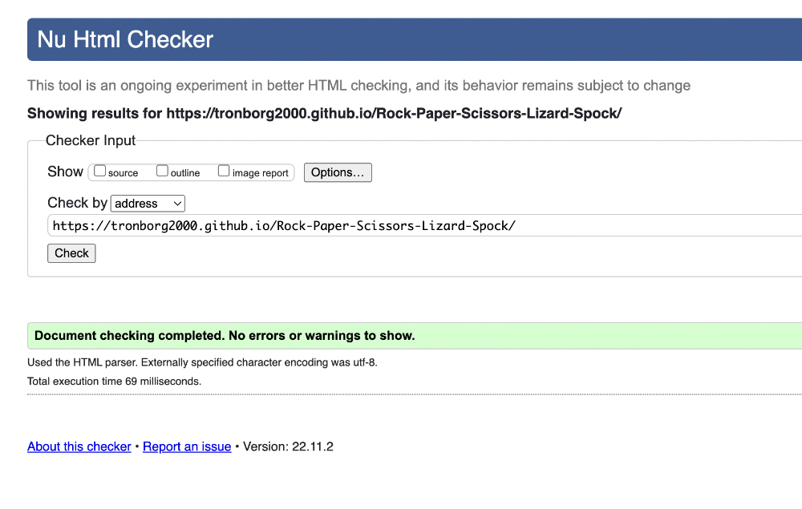
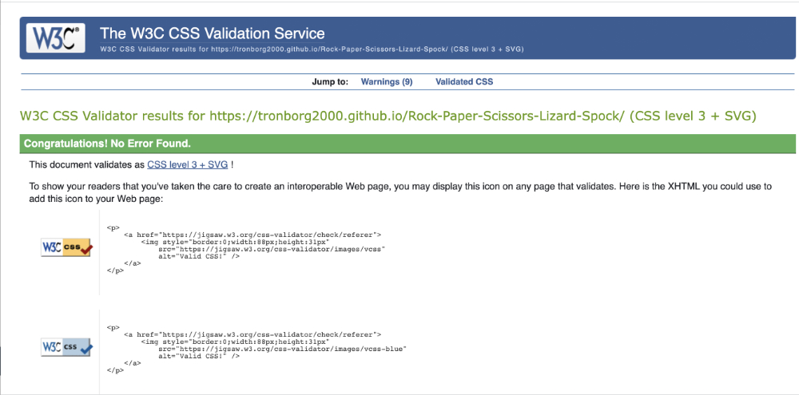
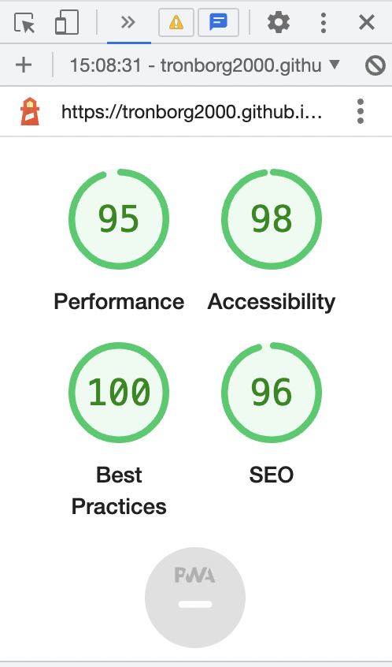

# ROCK PAPER SCISSORS LIZARD SPOCK SITE 
This site is a simple game playing rock paper scissors lizard spock. It provides a real world interactive site that allows users to compete against the computer utilising visual responsive images to indicate both the user choice and the computer choice. It shows the current user choice and computer choice and indicates whether or not you have won or lost the game and displays the current score. 

## Features 
- The Logo and Heading 
    - At the top of the page you have the Rock Paper Scissors Lizard Spock logo with all hand symbols clearly visible. The name of the game is also clearly visible and accessable to the user
    
   

   - __The Game Area__

   

  - This section will allow the user to play the rock, paper, scissors, lizard, spock game. The user will be able to select one of the responsive buttons making their choice, which is then reflected in the changing of the image in the player area. 
  - The Computer choice is then selected based on the JavaScript functionality and is reflected with an image corrisponding to the computer choice image. 

  - __The Score area__

  

    The score area keeps track of the current score between the computer and the user with an output message at the top letting the user know whether or not it is a win, lose or draw!

### CSS Code credit references 
.game CSS: Love maths project Code Institute 

### JS Code credit Reference 
Boiler code from Rock Paper scissors game tuturial 

## Testing 

### Validator Testing 

- HTML
    - No errors were returned when passing through the official [W3C validator] 
    
    https://validator.w3.org/nu/?doc=https%3A%2F%2Ftronborg2000.github.io%2FRock-Paper-Scissors-Lizard-Spock%2F
- CSS
    - No errors were found when passing through the official [(Jigsaw) validator]
    
    https://jigsaw.w3.org/css-validator/validator?uri=https%3A%2F%2Ftronborg2000.github.io%2FRock-Paper-Scissors-Lizard-Spock%2F&profile=css3svg&usermedium=all&warning=1&vextwarning=&lang=en

- JavaScript
    - No errors were found when passing through the official [Jshint validator](https://jshint.com/)
      - The following metrics were returned: 
      - Metrics
    - There are 4 functions in this file.

    - Function with the largest signature take 2 arguments, while the median is 1.

    - Largest function has 13 statements in it, while the median is 6.5.

    - The most complex function has a cyclomatic complexity value of 22 while the median is 2.5.

- Lighthouse Report 

## Links used references. 

https://www.youtube.com/watch?v=bd_1t-VY6R0 use of && correctly 

Bro Code Youtube Javascript : https://www.youtube.com/watch?v=8dWL3wF_OMw&t=1664s

HTML, CSS & JavaScript special edition by Mike McGrath

## Deployment

- The site was deployed to GitHub pages. The steps to deploy are as follows: 
  - In the GitHub repository, navigate to the Settings tab 
  - From the source section drop-down menu, select the Master Branch
  - Once the master branch has been selected, the page will be automatically refreshed with a detailed ribbon display to indicate the successful deployment. 

The live link can be found here - https://github.com/tronborg2000/Rock-Paper-Scissors-Lizard-Spock

### Media

- The photos used on the home and sign up page are from This Open Source site
- The images used for the gallery page were taken from this other open source site

